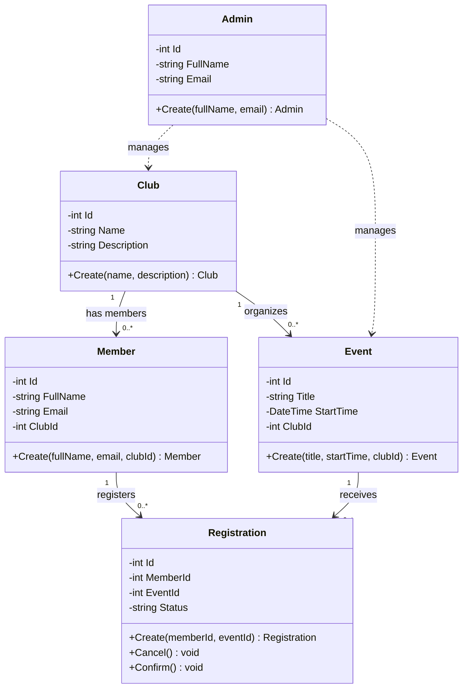

# Nhiem vu 2 - So do lop EduHub

```mermaid
classDiagram
    class Club {
        -int Id
        -string Name
        -string Description
        +Create(name, description) Club
    }

    class Member {
        -int Id
        -string FullName
        -string Email
        -int ClubId
        +Create(fullName, email, clubId) Member
    }

    class Event {
        -int Id
        -string Title
        -DateTime StartTime
        -int ClubId
        +Create(title, startTime, clubId) Event
    }

    class Registration {
        -int Id
        -int MemberId
        -int EventId
        -string Status
        +Create(memberId, eventId) Registration
        +Cancel() void
        +Confirm() void
    }

    class Admin {
        -int Id
        -string FullName
        -string Email
        +Create(fullName, email) Admin
    }

    Club "1" --> "0..*" Member : has members
    Club "1" --> "0..*" Event : organizes
    Member "1" --> "0..*" Registration : registers
    Event "1" --> "0..*" Registration : receives
    Admin ..> Club : manages
    Admin ..> Event : manages
```
